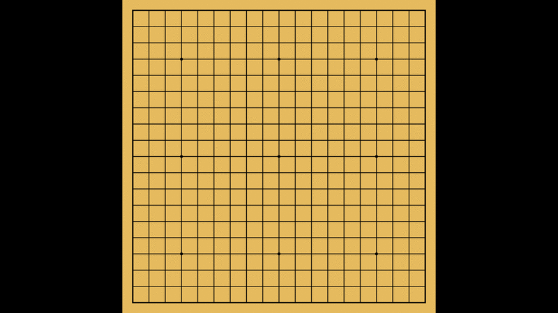

# Goban Screenhack

Goban hack for xscreensaver.

## Installation

### Debian/Ubuntu

Look for the `.deb` package
[here](https://github.com/julianandrews/goban-screenhack/releases).

### Other x84_64 Linux

There's a binary on the
[releases](https://github.com/julianandrews/goban-screenhack/releases) page.

Put the `goban` executable in the same place as your other hacks (probably
`/usr/lib/xscreensaver`).

For a better experience when configuring put `config/goban.xml` from the source
package with your other xscreensaver config files
(probably`/usr/share/xscreensaver/config`). Configure by running
`xscreensaver-demo` or by editing `~/.xscreensaver` directly.

## SGF file locations

By default, Goban Screenhack looks for SGF files in `goban-screenhack` under
your [XDG data
directories](https://specifications.freedesktop.org/basedir-spec/basedir-spec-latest.html).
For most users putting SGFs under `~/.local/share/goban-screenhack` should
work. You can override this behavior by passing one or more `-sgf-dir` flags to
the `goban` binary (configured either by editing `~/.xscreensaver` or under the
advanced tab in `xscreensaver-demo`).

## Supported Platforms

Currently `goban-screenhack` only works on Linux under XWindows. Most of the
code is platform agnostic though, so porting to other platforms may be an
option. If you know how to write an OpenGL screensaver in Rust on MacOS or
Windows (or are willing to figure it out), get in touch with me! I will gladly
provide guidance and review PRs!
